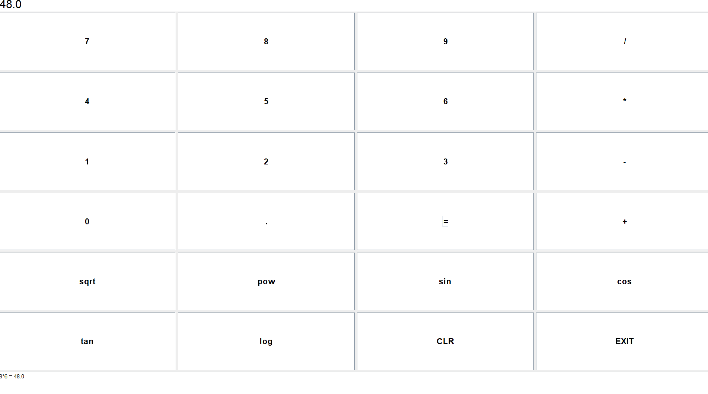

# ScientifcCalculator
# 🧮 Scientific Calculator - Java Swing GUI
A feature-rich scientific calculator built using **Java Swing**, designed with a clean **light theme**, a fully functional **GUI**, and **history tracking**. Ideal for students, developers, or anyone looking for a reliable calculator application.

## 🔧 Features

- ✅ Basic arithmetic: `+`, `-`, `×`, `÷`
- 🧠 Advanced functions: 
  - `sin`, `cos`, `tan` (degree-based)
  - `sqrt` (square root)
  - `log` (base-10 logarithm)
  - `pow` (exponentiation via `^`)
- 📝 Expression evaluation: Supports complex expressions like `3 + 4 * 2 / (1 - 5)^2`
- 📜 History view: Automatically tracks and displays past calculations
- 🎨 Light theme for a clean and modern look
- 🚪 CLR and EXIT buttons for clearing input and exiting the app

---

## 🖥️ GUI Preview

>   
*(Add your screenshot named `screenshot.png` here)*

---

## 📁 Project Structure
ScientificCalculator/
├── src/
│ └── ScientificCalculator.java
├── out/
│ └── artifacts/ (contains built .jar)
├── README.md
└── ScientificCalculator.jar 

## 🚀 How to Run

### 🛠️ Requirements
- Java JDK 8 or higher
- IntelliJ IDEA (or any Java IDE)

### ▶️ Run via IntelliJ
1. Open project in IntelliJ
2. Run the `main` method in `ScientificCalculator.java`

### 🏗️ Run the `.jar` file
1. Navigate to your `.jar` location (usually in `out/artifacts/`)
2. Run via terminal:

java -jar ScientificCalculator.jar
🗃️ How to Build JAR in IntelliJ
Go to File > Project Structure > Artifacts

Click + > JAR > From modules with dependencies

Choose your main class

Apply and close

Then go to Build > Build Artifacts > Build

🧠 Learning Points
Swing-based GUI design

Stack-based history management

Custom expression parser (recursive descent)

Error handling and scientific computation
📜 License
This project is open-source and free to use for educational purposes.
🙋‍♂️ Author
Made with ❤️ by 
[ayush Bharti
Manas Shahi
Mansi kannaujiya
Aryan Tiwari]
If you're viewing this for submission, thank you!

